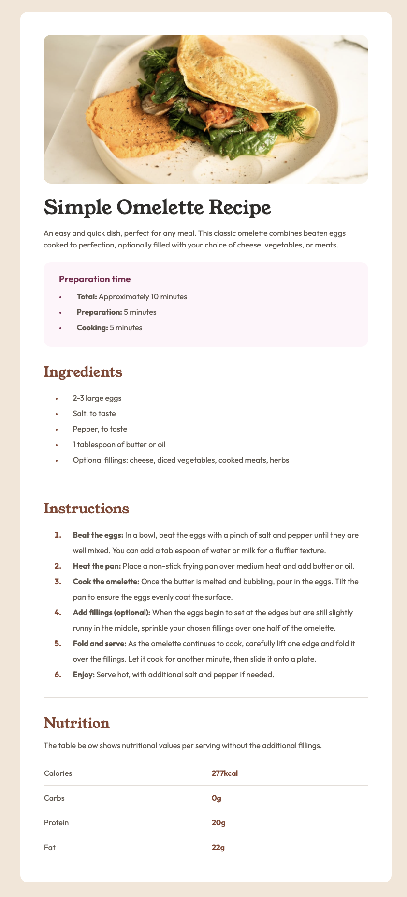

# Frontend Mentor - Recipe page solution

This is a solution to the [Recipe page challenge on Frontend Mentor](https://www.frontendmentor.io/challenges/recipe-page-KiTsR8QQKm). Frontend Mentor challenges help you improve your coding skills by building realistic projects. 

## Table of contents

- [Overview](#overview)
  - [The challenge](#the-challenge)
  - [Screenshot](#screenshot)
  - [Links](#links)
- [My process](#my-process)
  - [Acomplishments](#acomplishments)
  - [Resources](#resources)
- [Author](#author)

**Note: Delete this note and update the table of contents based on what sections you keep.**

## Overview

### Screenshot

### Links

- Solution URL: [Solution](https://github.com/minahopgood/FEM-recipe-card)
- Live Site URL: [Live site](https://minahopgood.github.io/FEM-recipe-card/)

## My process

### Acomplishments
I'm proud of my labeling during this challenge. I took a holiday halfway through creating this project, and came back to it quite easily because of the classes and id's used. It gave me a bit of a boost knowing that I am on the right track!

### Resources
- Semantic HTML: [Semrush}(https://www.semrush.com/blog/semantic-html5-guide/) I used this website to help me understand semantic HTML a bit better, and to see which tags I should use for which sections of my website.
- Tag list: [W3 Schools](https://www.w3schools.com/tags/default.asp) This list of semantic HTML tags by W3 Schools really helped me see the full extent of what you can do with semantic markup.

## Author

- GitHub - [Mina Hopgood](https://github.com/minahopgood)
- Frontend Mentor - [@minahop](https://www.frontendmentor.io/profile/minahopgood)

